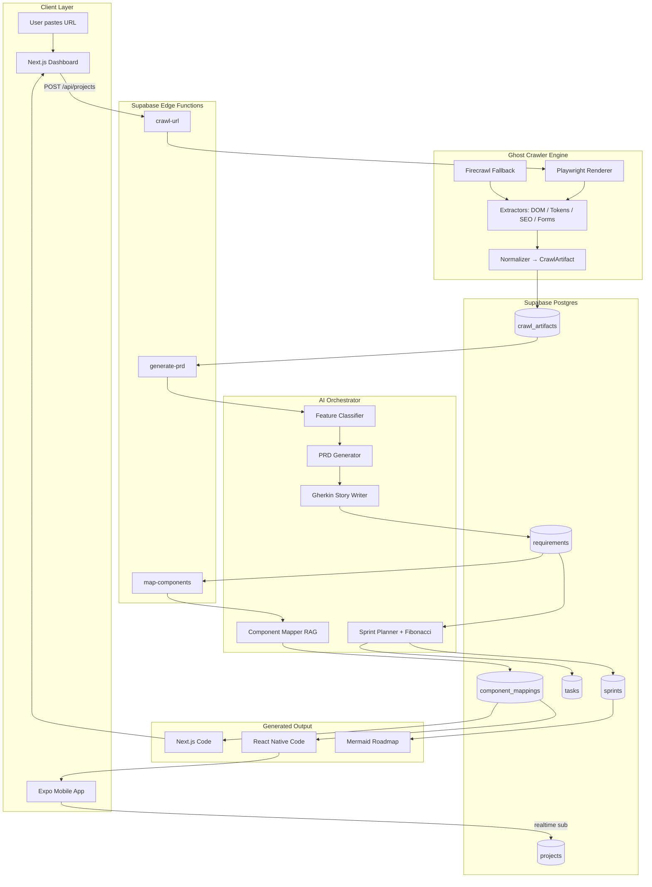

# Project Nexus — System Architecture

## High-Level Pipeline



## Module Responsibilities

### A. Ghost Crawler (`packages/crawler-engine`)
1. **Playwright renderer** — launches headless Chromium, executes JS, waits for `networkidle`.
2. **Extractor pipeline** runs in parallel:
   - `dom.ts` — component tree (nav, forms, auth flows, CTAs).
   - `tokens.ts` — colors (walks computed styles), type scale, spacing rhythm, radii.
   - `seo.ts` — `<meta>`, `<link rel="canonical">`, OpenGraph, JSON-LD (Schema.org).
   - `forms.ts` — detects input semantics → infers auth/checkout/contact patterns.
3. **Firecrawl fallback** — if Playwright times out or site is JS-heavy SPA with auth, fall back to Firecrawl markdown.
4. **Normalizer** — emits canonical `CrawlArtifact` (Zod-validated) → written to `crawl_artifacts` row.

### B. Feature-to-Requirement Engine (`packages/ai-orchestrator/chains`)
Prompt chain (Vercel AI SDK `streamObject` with Zod):

```
CrawlArtifact
  ↓  classifyFeatures()     → Feature[] (typed: auth | commerce | content | search …)
  ↓  clusterIntoEpics()     → Epic[]
  ↓  writePRD()             → PRD markdown + FunctionalSpec[]
  ↓  writeGherkinStories()  → Story[] in Given/When/Then
  ↓  persist to requirements table
```

All LLM calls use **prompt caching** (long system prompt cached, user artifact as dynamic suffix).

### C. Sprint Orchestrator (`packages/sprint-engine`)
- **Fibonacci estimator** — tokenizes story, uses LLM with few-shot reference stories → 1/2/3/5/8/13.
- **Sprint packer** — bin-packs stories into 2-week sprints with capacity constraint (default 30pts/sprint).
- **Roadmap generator** — emits Mermaid `gantt` or `graph LR` for the project timeline.

### D. GitHub Component Mapper (`packages/ai-orchestrator/agents/component-mapper.ts`)
- Ingest-time: scrape Aceternity UI, Magic UI, Shadcn registries → embed component descriptions → Pinecone.
- Query-time: for each `FunctionalSpec`, embed and retrieve top-3 candidate components with install commands and copy-paste code.
- Output: `component_mappings` rows (`requirement_id → { registry, component_name, install_cmd, code_url }`).

## Web-to-Mobile Bridge

**Shared-logic layer** (`packages/shared-logic`) is the seam:
- Zod schemas (single source of truth for data shapes).
- Pure TS business logic (auth flow state machines, form validation, API clients).
- Supabase client factory (platform-agnostic).

**Divergent layer**:
- `apps/web` — Next.js server components + Shadcn (web-only).
- `apps/mobile` — Expo Router + **Tamagui** or **NativeWind** (same Tailwind tokens → native styles).

**Code generation strategy**:
1. Crawled design tokens → emit a single `tokens.json` consumed by both Tailwind config and Tamagui theme.
2. For each mapped feature, generate **two adapters**:
   - Web adapter: Shadcn + Next.js route handler.
   - Mobile adapter: RN equivalent component using shared hooks from `shared-logic`.
3. Business logic (hooks like `useAuthFlow`, `useCheckout`) lives once in `shared-logic` and is imported by both apps — **no duplication**.

This means ~70% of feature code is shared; only the rendering layer diverges.
