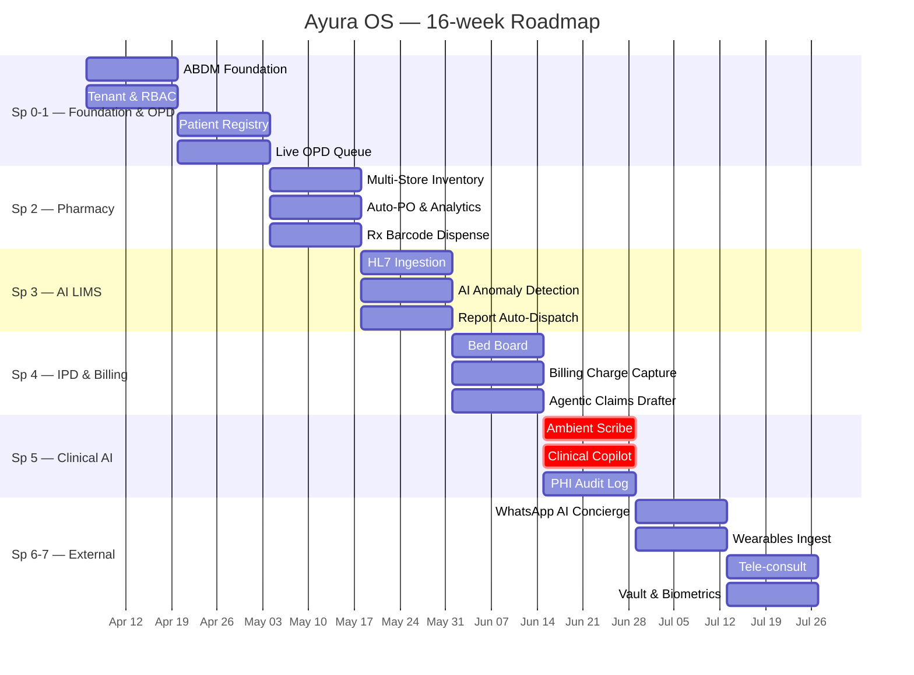

# Ayura OS — Sprint Plan

**Cadence:** 2-week sprints · **Capacity:** 30 pts/sprint (2 full-stack engineers + 0.5 PM/design)
**Prioritization:** P0 before P1, larger story first within a priority (de-risk early).

---

## Sprint 0 · 2026-04-06 → 2026-04-19 · **18 pts**
**Goal:** Infrastructure and ABDM base layer.

| Pts | Priority | Story | Slug |
|---|---|---|---|
| 8 | P0 | ABDM FHIR database schema & RLS | `S-ABDM-1` |
| 5 | P0 | Tenant onboarding wizard | `S-AUTH-1` |
| 5 | P0 | AI Orchestrator package setup | `S-AI-1` |

## Sprint 1 · 2026-04-20 → 2026-05-03 · **26 pts**
**Goal:** Patient registry and OPD scheduling live.

| Pts | Priority | Story | Slug |
|---|---|---|---|
| 3 | P0 | Role-based navigation | `S-AUTH-2` |
| 3 | P0 | Patient OTP login (web + app shell) | `S-AUTH-3` |
| 8 | P0 | Fast patient registration w/ ABHA link | `S-EMR-1` |
| 5 | P0 | Patient timeline view | `S-EMR-2` |
| 7 | P0 | Real-time OPD queue board | `S-OPD-1` |

## Sprint 2 · 2026-05-04 → 2026-05-17 · **29 pts**
**Goal:** Pharmacy Maintenance core (Multi-store & Procurement).

| Pts | Priority | Story | Slug |
|---|---|---|---|
| 8 | P0 | Multi-store inventory sync & transfers | `S-PHARM-1` |
| 5 | P0 | Auto-generated Supplier POs | `S-PHARM-2` |
| 5 | P0 | Blind stock reconciliation workflow | `S-PHARM-3` |
| 5 | P0 | Barcode dispense-against-Rx | `S-PHARM-4` |
| 6 | P0 | Pharmacy & GST Analytics Dashboard | `S-ANALYTICS-1` |

## Sprint 3 · 2026-05-18 → 2026-05-31 · **28 pts**
**Goal:** AI-Native LIMS closed loop.

| Pts | Priority | Story | Slug |
|---|---|---|---|
| 5 | P0 | Barcode sample tracking (LIMS core) | `S-LIMS-1` |
| 13 | P0 | HL7 analyzer result ingestion | `S-LIMS-2` |
| 5 | P0 | AI Anomaly Detection on lab results | `S-LIMS-3` |
| 5 | P0 | Auto-dispatch signed lab report | `S-LIMS-4` |

## Sprint 4 · 2026-06-01 → 2026-06-14 · **26 pts**
**Goal:** IPD live + first end-to-end billing.

| Pts | Priority | Story | Slug |
|---|---|---|---|
| 8 | P0 | Drag-and-drop bed allocation | `S-IPD-1` |
| 5 | P0 | Charge auto-capture (billing) | `S-BILL-1` |
| 8 | P0 | Agentic Claim Drafter (LLM) | `S-BILL-2` |
| 5 | P0 | Nightly backup + quarterly restore drill | `S-BACKUP-1` |

## Sprint 5 · 2026-06-15 → 2026-06-28 · **26 pts**
**Goal:** Clinical AI Assistants (Scribe & Copilot).

| Pts | Priority | Story | Slug |
|---|---|---|---|
| 13 | P0 | Ambient Clinical Scribe (Speech to SOAP) | `S-AI-2` |
| 8 | P0 | Clinical Copilot Q&A Right-Rail | `S-AI-3` |
| 5 | P0 | Append-only PHI audit log | `S-AUDIT-1` |

## Sprint 6 · 2026-06-29 → 2026-07-12 · **26 pts**
**Goal:** Advanced patient engagement.

| Pts | Priority | Story | Slug |
|---|---|---|---|
| 8 | P1 | WhatsApp AI Concierge | `S-APP-1` |
| 5 | P1 | Slot self-booking (patient app) | `S-OPD-2` |
| 5 | P0 | Offline cached reports (patient app) | `S-APP-2` |
| 8 | P1 | Wearable Data Ingest (Apple/Cloud) | `S-WEARABLE-1` |

## Sprint 7 · 2026-07-13 → 2026-07-26 · **26 pts**
**Goal:** Polish, Tele-consult, and remaining features.

| Pts | Priority | Story | Slug |
|---|---|---|---|
| 13 | P1 | Tele-consultation with in-call Rx | `S-OPD-3` |
| 5 | P1 | Levey–Jennings QC chart (LIMS) | `S-LIMS-5` |
| 3 | P1 | Biometric lock (patient app) | `S-APP-3` |
| 5 | P1 | Document vault with signed URLs | `S-EMR-3` |

## Sprint 8 · 2026-07-27 → 2026-08-09 · **26 pts**
**Goal:** Clinical parity — IP Dashboard, Nurse Station, Discharge Summary.

| Pts | Priority | Story | Slug |
|---|---|---|---|
| 5 | P0 | IP Admissions Dashboard (KPIs + occupancy) | `S-IPD-2` |
| 8 | P1 | Nurse Station — vitals charting & task board | `S-IPD-3` |
| 8 | P1 | LLM-assisted Discharge Summary generator | `S-EMR-4` |
| 5 | P1 | MIS Reports (census, revenue, procedure counts) | `S-REPORT-1` |

## Sprint 9 · 2026-08-10 → 2026-08-23 · **21 pts**
**Goal:** SaaS product layer — public site, pricing, super-admin.

| Pts | Priority | Story | Slug |
|---|---|---|---|
| 5 | P0 | Marketing landing site (replaces blank home page) | `S-SAAS-1` |
| 3 | P1 | Pricing page + self-serve hospital signup | `S-SAAS-2` |
| 8 | P1 | Super-admin portal — manage all hospital tenants | `S-SAAS-3` |
| 5 | P0 | WebAuthn / FIDO2 hardware key pairing | `S-AUTH-HWKEY` |

## Sprint 10 · 2026-08-24 → 2026-09-06 · **10 pts**
**Goal:** SaaS monetisation — metering & white-label.

| Pts | Priority | Story | Slug |
|---|---|---|---|
| 5 | P1 | Per-tenant usage metering (AI tokens, storage, API calls) | `S-SAAS-4` |
| 5 | P1 | White-label — custom domain + logo per tenant | `S-SAAS-5` |

## Sprint 11 · 2026-09-07 → 2026-09-20 · **37 pts**
**Goal:** Unified mobile app — all roles in one app, admin-controlled RBAC.

| Pts | Priority | Story | Slug |
|---|---|---|---|
| 8 | P0 | Role-based mobile nav shell + admin feature-flag panel | `S-MOB-RBAC` |
| 8 | P0 | Doctor mobile screens (OPD queue, EMR chart, AI Scribe, Rx writer) | `S-MOB-DOCTOR` |
| 8 | P0 | Admin mobile screens (KPI dashboard, bed board, billing, user-role manager) | `S-MOB-ADMIN` |
| 8 | P1 | Staff mobile screens (vitals charting, Rx dispense, lab worklist, task board) | `S-MOB-STAFF` |
| 5 | P1 | Patient app v2 (biometric lock, teleconsult, prescriptions, push notifications) | `S-MOB-PATIENT-V2` |

---

## Roadmap (Mermaid Gantt)

---

## Sprint 12 · 2026-09-21 → 2026-10-04 · **21 pts**
**Goal:** Production Wiring — Real AI & WebAuthn.

| Pts | Priority | Story | Slug |
|---|---|---|---|
| 13 | P1 | Real AI Implementations (Scribe/Concierge) | `S-AI-REAL` |
| 8 | P1 | WebAuthn and Biometrics Live | `S-AUTH-WEBAUTHN-LIVE` |

## Sprint 13 · 2026-10-05 → 2026-10-18 · **26 pts**
**Goal:** OT + Radiology modules.

| Pts | Priority | Story | Slug |
|---|---|---|---|
| 13 | P2 | Operation Theatre Scheduling | `S-OT-1` |
| 13 | P2 | Radiology Worklist & DICOM | `S-RAD-1` |

## Sprint 14 · 2026-10-19 → 2026-11-01 · **21 pts**
**Goal:** Go-to-Market — Subscriptions & Deletion.

| Pts | Priority | Story | Slug |
|---|---|---|---|
| 8 | P1 | Stripe Automated Billing Loop | `S-SAAS-6` |
| 13 | P2 | Tenant Offboarding & DISHA | `S-SAAS-7` |

## Sprint 15 · 2026-11-02 → 2026-11-15 · **21 pts**
**Goal:** Final Compliance & Infrastructure.

| Pts | Priority | Story | Slug |
|---|---|---|---|
| 13 | P1 | CI/CD, Error Tracking & Load Testing | `S-INFRA-1` |
| 8 | P1 | ABDM Verification Prep | `S-COMPLIANCE-1` |
